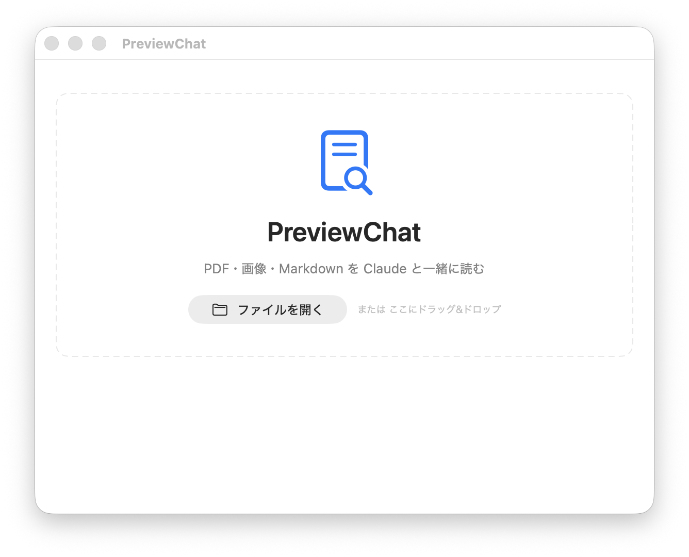

# PreviewChat

PDF・画像・Markdown を閲覧しながら、Claude と対話できる macOS 用ファイルビューワです。ファイルを開くと右側にチャットサイドバーが現れ、そのファイルについて Claude に質問できます。Claude Code と同じエージェント能力をそのまま使えます。

<p align="center">
  <a href="https://github.com/Ryosuke-On/Mac-Preview-ClaudeCode-Sidebar/releases/latest">
    
  </a>
</p>

## スクリーンショット

### ウェルカム画面 — ドラッグ＆ドロップ・最近開いたファイル



### PDF + チャット — 要約・質問・エージェント操作


### 引用バッジ — PDF 箇所へのジャンプ・Web リンク


---

## 主な機能

### ファイルビューワ

| 形式 | 機能 |
|------|------|
| **PDF** | PDFKit ベース。トラックパッドのピンチズーム・テキスト選択・システム翻訳・辞書がネイティブ動作。⌘F で PDF 内検索バー表示、マッチ箇所をハイライト。 |
| **画像** | PNG / JPEG / HEIC / GIF / WebP 等。ピンチズーム＆パン対応。**Vision**: Claude がファイルを直接認識・説明。 |
| **Markdown / テキスト** | NSTextView でレンダリング。⌘F でシステム標準の検索バー。翻訳・辞書・検索すべて利用可能。 |

### チャットサイドバー

- **ストリーミング応答** — Claude の回答がリアルタイムで流れ込む。途中で「停止」ボタンを押せばその時点で中断し、入力欄に送信済みテキストが復元される。
- **Markdown + 数式レンダリング** — 回答は marked.js + KaTeX で整形。コードブロック・表・行列（`\begin{pmatrix}` 等）もきれいに表示。
- **モデル選択** — ヘッダーの Haiku / Sonnet / Opus プルダウンでモデルを切り替え。文脈は維持される。
- **ファイル別チャット履歴** — 同じファイルを再度開けば前回の会話が復元。Claude も `--resume <session_id>` で続きから応答する。
- **トークンカウンタ** — ヘッダーに「累計 ↑Xk ↓Xk」、各 Claude 応答の下に「↑X ↓X tokens」を表示。
- **チャット内検索** — チャット欄にフォーカスした状態で ⌘F。マッチ箇所が黄色ハイライト、件数を表示。
- **PDF テキスト選択→質問** — PDF でテキストを選択して右クリック→「Claude に質問…」で、引用付きの質問文を自動入力。

### 引用バッジ（Citations）

Claude の回答に含まれる `[[cite:ページ|引用]]` マーカーが青いバッジに変換される。クリックすると PDF がそのページに飛び、引用テキストをハイライト。

Web 検索・参照からの引用は `[[web:URL|ラベル]]` が緑の 🌐 バッジになり、クリックでブラウザが開く。

### ウェルカム画面

- ドラッグ＆ドロップでファイルを開く（点線枠エリア）
- 最近開いたファイル一覧（Finder アイコン付き）
- クリックで即座に再オープン

### メニュー統合

| メニュー | 操作 |
|---------|------|
| **ファイル** | ⌘O で開く、⌘P で印刷、ページ設定 |
| **表示** | ズームイン / アウト / 実際のサイズ / ウィンドウに合わせる、⌘F で検索 |
| **移動** | ← → で前後ページ、先頭・末尾ページ |

### レイアウト

- ビューワ：チャット = 初期 **3:1**。ドラッグで調整した幅は永続化（`@AppStorage`）。
- チャットパネルは非表示ボタンで畳める。非表示中は右上に再表示ボタンが浮遊。

---

## 必要なもの

- **macOS 14** 以上（macOS 15 / 26 で動作確認済み）
- **[Claude Code](https://docs.anthropic.com/ja/docs/claude-code)** CLI（`claude` コマンドが PATH 上にある状態）
- Xcode 15 以上（ビルド時）

> Claude Code が未インストールの場合は `npm install -g @anthropic-ai/claude-code` でインストールしてください。

---

## ビルド

```sh
# 依存ツール（XcodeGen）
brew install xcodegen

# プロジェクト生成 & ビルド
git clone https://github.com/Ryosuke-On/Mac-Preview-ClaudeCode-Sidebar.git
cd Mac-Preview-ClaudeCode-Sidebar
xcodegen generate
open PreviewChat.xcodeproj   # Xcode で開いて ▶ ボタン
```

または CLI だけでビルド：

```sh
xcodebuild \
  -project PreviewChat.xcodeproj \
  -scheme PreviewChat \
  -configuration Release \
  CODE_SIGNING_ALLOWED=NO \
  build
```

---

## ダウンロード（ビルド済みアプリ）

[Releases ページ](https://github.com/Ryosuke-On/Mac-Preview-ClaudeCode-Sidebar/releases/latest) から `PreviewChat-vX.Y.Z.dmg` をダウンロードしてください。

### インストール手順

1. DMG をダブルクリックして開き、`PreviewChat.app` を **Applications** にドラッグ
2. **ターミナルで以下を 1 回実行**（未署名アプリの隔離属性を解除）：
   ```sh
   sudo xattr -dr com.apple.quarantine /Applications/PreviewChat.app
   ```
3. Launchpad や Finder からダブルクリックで起動

### 「"PreviewChat" は壊れているため開けません」と出た場合

`com.apple.quarantine` 属性のためで、アプリ自体は正常です。上の手順 2 のコマンドを実行してください。

---

## アーキテクチャメモ

- **AppDelegate + NSHostingView** で NSWindow を手動管理（SwiftUI WindowGroup 非使用）。`.toolbar` はクラッシュするため NotificationCenter 経由でメニュー操作をルーティング。
- **claude CLI** を `--output-format stream-json --verbose` で常駐サブプロセスとして起動。`assistant` イベントの `message.usage` と `result` イベントの `usage` の両方からトークン数を収集。
- **WKWebView（PassthroughWebView）** でチャットメッセージをレンダリング。KaTeX + marked.js を埋め込み。スクロールイベントは `nextResponder` へ転送。
- **PDFFindController** を ObservableObject として PDFKitContainer と SwiftUI find bar overlay が共有。
- **Vision 対応**: PNG/JPEG/GIF/WebP は直接 Base64 エンコード、HEIC/TIFF/BMP は NSImage→NSBitmapImageRep→PNG に変換してから送信。

---

## ライセンス

MIT
